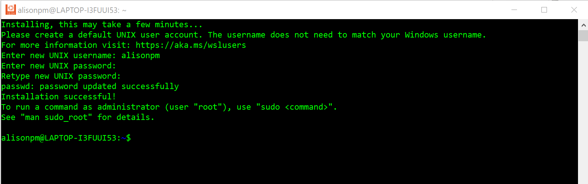

## WSL, Python & PostgreSQL

What to set up before `pip install apache-airflow`

Why are these steps needed?
- Apache Airflow only works on unix-based platforms (Linux/mac)
- Apache Airflow is written in Python
- Airflow requires a database backend to store all the records and logs of jobs running. 

## Opening WSL for the first time

### Launching WSL
Prerequisites: 
 - [x] working version of PowerShell
 - [x] installed Ubuntu from Microsoft Store

Open PowerShell and type `wsl`. I did that and got this message:


So it's not enough to _install_ Ubuntu, you need to _open_ it before WSL will work. So went back to the Microsoft store and clicked "open"


Once I opened it I was prompted for the following:


I chose a username and password and the installation went forward! (note how the header changes after I set my username!)



You can now access Ubuntu _directly_ by opening the Ubuntu app on your computer _or_ by opening PowerShell and typing `wsl`.

### Root permissions and installs
All of the installations in the next step you are going to do with `admin` level permissions, or `root` permissions. To switch to `root` permissions you will type and enter:

```
sudo su
```
Then enter your password when prompted. (note the header will change again!)

```
# update system packages
apt-get update

#install a whole bunch of new ones:
apt install -y make build-essential libssl-dev zlib1g-dev \
> libbz2-dev libreadline-dev libsqlite3-dev wget curl llvm libncurses5-dev\
> libncursesw5-dev xz-utils tk-dev libffi-dev liblzma-dev python-openssl\
> git
```
<details>
  <summary>want more detail about a few of those installs? click me!</summary>
  
  | command package | what it's for |
  |:----------------|:--------------|
  | `make` | used to build and maintain groups of programs and files from the source code |
  | `wget` | package for downloading files from the web through the command line|
  | `curl` | curl is also for interacting with the internet more broadly, including APIs, and handling more file types|
  | `git` | used for version control and accessing code on the internet |

</details>

## Installing and setting up Python in WSL

Still in WSL with sudo su permissions, here's the next code to run. [Justin Palmer's instructions](https://www.liquidweb.com/kb/how-to-install-pyenv-on-ubuntu-18-04/) were helpful.

```
# install package - see my NOTE below if you get an error about ~/.pyenv already existing

git clone https://github.com/pyenv/pyenv.git ~/.pyenv
exec "$SHELL"

# set environmental variables to be able to find pyenv
echo 'export PYENV_ROOT="$HOME/.pyenv"' >> ~/.bashrc
echo 'export PATH="$PYENV_ROOT/bin:$PATH"' >> ~/.bashrc
echo -e 'if command -v pyenv 1>/dev/null 2>&1; then\n eval "$(pyenv init -)"\nfi' >> ~/.bashrc

# install and set python version to 3.8.10
pyenv install 3.8.10
pyenv global 3.8.10

# confirm success, should both sat 3.8.10
pyenv version
python --version
```

## Airflow Architecture

[Airflow's architecture](https://airflow.apache.org/docs/apache-airflow/stable/_images/arch-diag-basic.png) is fairly straightforward, but I find the documentation has the feeling of being written by engineers FOR engineers. There is much more to say describing the full picture of [Airflow's architecture](https://airflow.apache.org/docs/apache-airflow/stable/core-concepts/overview.html#user-interface). Right now we are focusing on the installations and set up if the backend database. Out of the [options](https://airflow.apache.org/docs/apache-airflow/stable/howto/set-up-database.html#choosing-database-backend), I used Postgres.

##### What we are installing!


### Postgres Installation and setup


